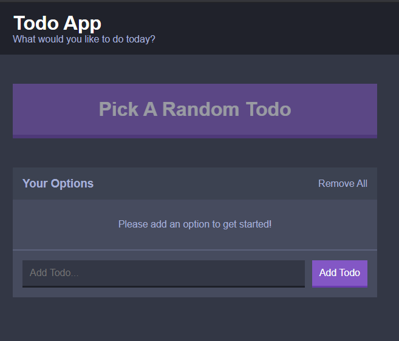
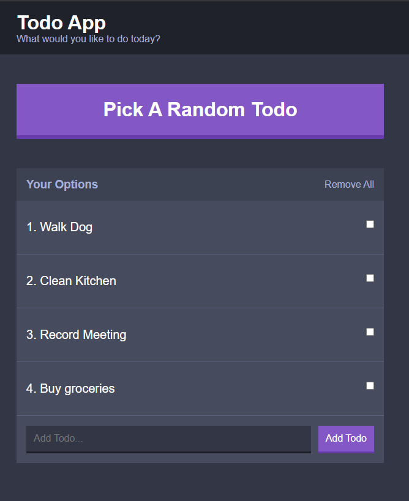
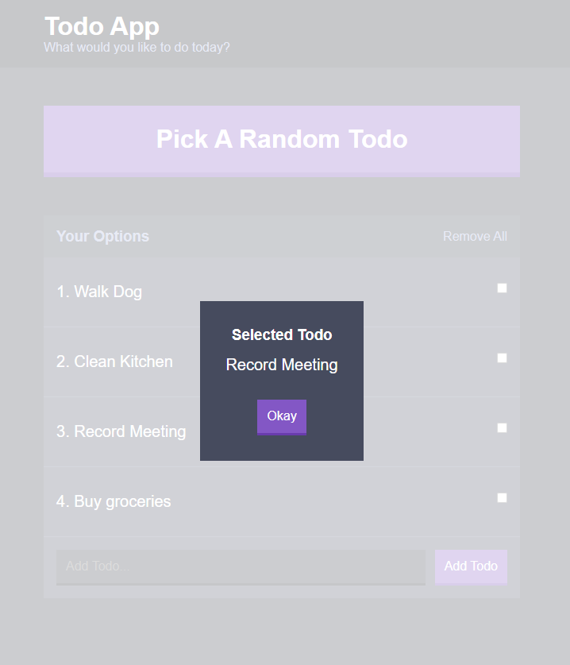

# Indecision App
     

---

## Description:
This is a simple React decision-making application that accepts items(options) from the user and randomly selects and renders one in a modal. The app uses _LocalStorage_ to store the user's options so that they can be viewed again later. See the [usage](#usage) section for a more detailed explanation on how to use this application.


I learnt how to use and implement SCSS as well as configure a webpack file. The playground folder contains practise code and a jsx version of the application.

This application was created using _ReactJS_, as well as _React Props_, State(JSON) and LocalStorage.

---

## Table of Contents:
* [Setup](#setup)
* [Usage](#usage)
* [License](#license)
* [Resources](#resources)
* [Status](#status)
* [Inspiration](#inspiration)
* [Future Improvements](#future-improvements)

---

## Setup:
To run this project locally, follow the steps below:
```
$ cd ./indecision-app
$ yarn install
$ yarn run dev-server
```

Alternatively you can use npm:

```
$ cd ./indecision-app
$ npm install
$ npm run dev-server
```
---


## Usage:
To use the application, go to __[this link](https://pmw-indecision-app.netlify.app/)__.



Steps to use this application:
* __step 1:__ Input an option and click the "Add Option" button.


* __step 2:__ Click the 'What Should I Do' button to randomly select and display an option.




---
The [playground folder](./src/playground/) contains practise code I used to understand the concepts better, with a version of the application written in JSX.

| [file path](./src/playground/jsx-indecision.js)     | 
| :---------------------------------:|


```javascript
const appRoot = document.getElementById('app');

const renderApp = () => {
	const template = (
		<div>
			<h1>{app.title}</h1>
			{app.subtitle && <p>Subtitle: {app.subtitle}</p>}
			<p>
				{app.options.length > 0
					? 'Here are your options'
					: 'There are no options'}
			</p>
			
			<button disabled={app.options.length < 2 } onClick={onMakeDecision}>What should I do?</button>

			<button onClick={deleteAll}>Delete All</button>

			<ol>
				{app.options.map((option, index) => {
					{
						/* index creates unique numbers to id each option in the array */
					}
					return <li key={index}> {option} </li>;
				})}
			</ol>
			<form onSubmit={onFormSubmit}>
				<input type='text' name='option' />
				<button>Add Option</button>
			</form>
		</div>
	);

	ReactDOM.render(template, appRoot);
};

renderApp();
```


## License:
[MIT License](https://opensource.org/licenses/MIT)

Copyright © 2020 Paul Wachira

Permission is hereby granted, free of charge, to any person obtaining a copy
of this software and associated documentation files (the "Software"), to deal
in the Software without restriction, including without limitation the rights
to use, copy, modify, merge, publish, distribute, sublicense, and/or sell
copies of the Software, and to permit persons to whom the Software is
furnished to do so, subject to the following conditions:

The above copyright notice and this permission notice shall be included in all
copies or substantial portions of the Software.

THE SOFTWARE IS PROVIDED "AS IS", WITHOUT WARRANTY OF ANY KIND, EXPRESS OR
IMPLIED, INCLUDING BUT NOT LIMITED TO THE WARRANTIES OF MERCHANTABILITY,
FITNESS FOR A PARTICULAR PURPOSE AND NONINFRINGEMENT. IN NO EVENT SHALL THE
AUTHORS OR COPYRIGHT HOLDERS BE LIABLE FOR ANY CLAIM, DAMAGES OR OTHER
LIABILITY, WHETHER IN AN ACTION OF CONTRACT, TORT OR OTHERWISE, ARISING FROM,
OUT OF OR IN CONNECTION WITH THE SOFTWARE OR THE USE OR OTHER DEALINGS IN THE
SOFTWARE.

---

## Resources:
* [ReactJS](https://reactjs.org/docs/getting-started.html)
* [React Props]()
* [SASS - SCSS preprocessor]()
* [BEM naming convention]()


---
## Status
Project is: _finished_

---

## Inspiration
Project based on Andrew Mead React Course on _Udemy - The Complete React Developer Course_.


---

## Future Improvements:
* Use React Hooks
* Use React-Redux to access State globally.
* Use a database such as MongoDB.


---

